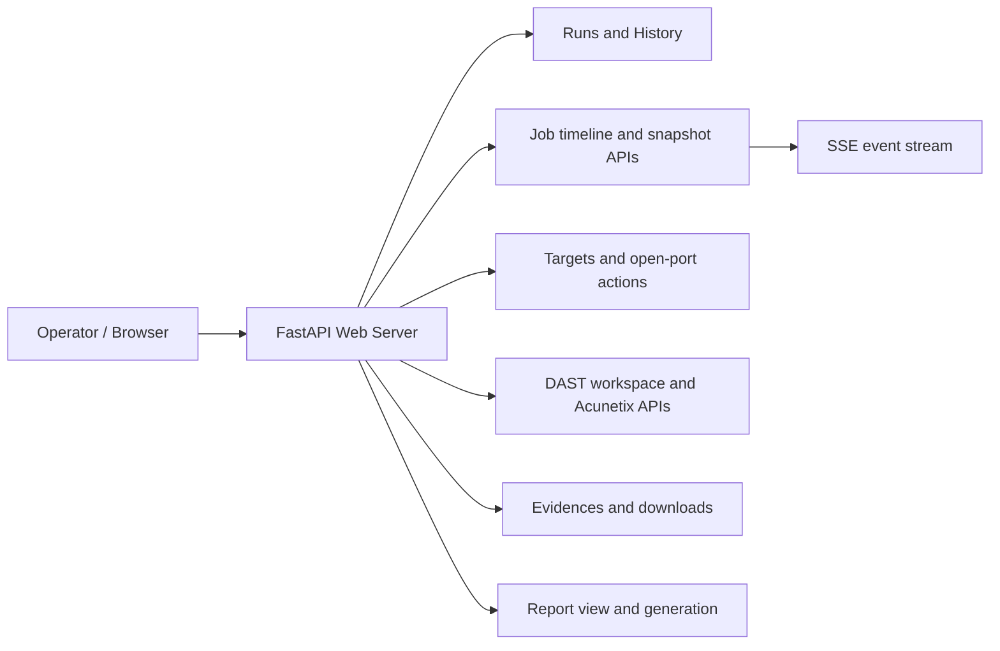
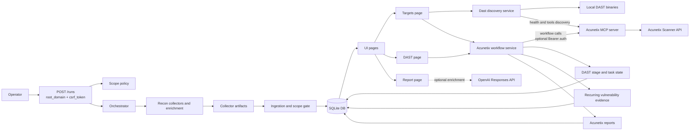
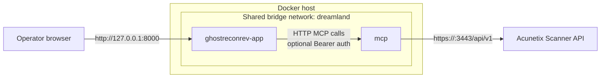

# GhostReconRev

GhostReconRev is a reconnaissance UI for assessments. It runs a deterministic
pipeline for scope-seeded domain discovery and enrichment, stores evidence with
provenance, and streams run progress in real
time.

## Web API Map



## Pipeline Component Interaction Map



## Docker Integration Topology



## Prerequisites

Install these binaries in `PATH` or place them in `tools/bin/`:

- `amass`
- `assetfinder`
- `subfinder`
- `gau`
- `host`
- `dnsx`
- `naabu`
- `nerva`
- `httpx`

If a collector is missing or fails, its task is marked `FAILED` and the run may
end `FAILED`.

For Acunetix integration, make sure the following conditions are met.

- Run a reachable [`MCPwnetix`](https://github.com/therealcoiffeur/MCPwnetix)
server.
- Point `ACUNETIX_MCP_URL` and `ACUNETIX_MCP_HEALTH_URL` at that server.

These environment variables may be required before startup.

- `APP_AUTH_USERNAME` and `APP_AUTH_PASSWORD` if `APP_REQUIRE_AUTH=true`.
- `OPENAI_API_KEY` only if you use report enrichment.
- `TELEGRAM_BOT_TOKEN` and `TELEGRAM_CHAT_ID` only if `TELEGRAM_TIMELINE_ENABLED=true`.
- `ALLOWED_HOSTS` if you expose the app on a hostname or IP other than `127.0.0.1`,
`localhost`, `::1`, `ghostreconrev-app`, or `ghostreconrev`.
- `ACUNETIX_MCP_URL` and `ACUNETIX_MCP_HEALTH_URL` if you enable the optional
Acunetix integration.

For containerized runs, make sure the tooling is prepared as described below.

- Place executable collector binaries in `tools/bin/` before `docker compose build`.
- At minimum, if you want the full pipeline, provide:
  - `amass`
  - `assetfinder`
  - `subfinder`
  - `gau`
  - `dnsx`
  - `naabu`
  - `httpx`
- Add `nerva` as well if you want the optional active service profiling task.
- The image already provides `host` and `libpcap.so` (required by some tools).

## Docker

Build and start the stack.

```bash
cp .env.example .env
docker compose build --no-cache
docker compose up
```

Open the UI at the following address.

`http://127.0.0.1:8000`

From another container attached to `ghostreconrev-net`, use the following
address.

## DAST Workflow Notes

Manual Acunetix launches from Targets follow this flow.

1. Open `Targets`.
2. Open a host's `Open Ports` modal.
3. Click `dast` beside the relevant port.
4. Choose `Acunetix` in the DAST modal.

When a scan is launched, GhostReconRev behaves as follows.

- A DAST stage and task are created if needed.
- A completed job can be reopened as `RERUNNING`.
- Workflow polling drives the DAST task status.
- Vulnerability content is pulled repeatedly during the run and stored as
evidence.
- The workflow fails if the scan does not complete within 4 hours.

The DAST page supports the following actions.

- Live workflow tracking.
- Acunetix report download for completed workflows.
- Import of an external `scan_id` so vulnerability content from scans launched
outside the pipeline can still be attached to the job.

## Documentation

- [SECURITY.md](SECURITY.md) explains vulnerability reporting and deployment hardening.
- [docs/ARCHITECTURE.md](docs/ARCHITECTURE.md) provides the execution and data-flow overview.
