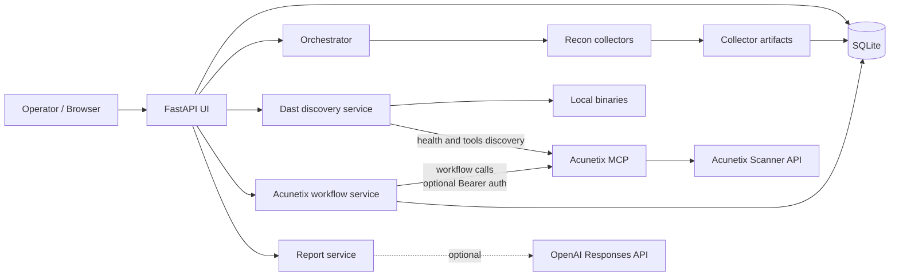
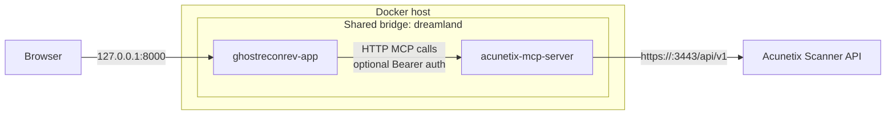

# Architecture Overview

GhostReconRev is an application that runs a deterministic recon pipeline,
stores all outputs as evidence with provenance, and can enrich a job with
operator-triggered Acunetix DAST workflows.

## High-Level Flow

1. Operator creates a run with a root domain.
2. Planner builds a deterministic task list.
3. Executor runs tasks stage by stage.
4. Collectors produce artifacts under `artifacts/collectors/`.
5. UI pages consume DB state and render timeline, targets, DAST workflows,
evidence, and reports.
6. The Targets page can discover optional DAST integrations on demand,
including a reachable Acunetix MCP server.

## System Context

## Data Model Notes

The core persisted types live in `recon_ui/app/db.py`.

- `Job`: run metadata and aggregate counters.
- `Stage`: ordered execution phases, including the DAST stage used for Acunetix
work.
- `Task`: unit of execution. Acunetix launches and imports create real DAST
tasks instead of in-memory-only workflow state.
- `Entity`: discovered targets such as domains and hostnames.
- `Evidence`: immutable artifact or provenance object. Live Acunetix
vulnerability content is persisted here as the scan progresses.
- `Assertion`: claims derived from evidence.
- `EventLog`: append-only timeline and audit stream.
- `OutOfScopeBlocked`: scope gate rejections.

## Docker Integration

When both Docker stacks run together, `GhostReconRev` joins the shared bridge
network `dreamland` and reaches `MCPwnetix` by container DNS at
`http://acunetix-mcp-server:3000`.

In practice, the Acunetix host can be one of the following.

- `host.docker.internal` when the scanner runs on the Docker host and that
name is resolvable.
- A reachable VM IP.
- Any other HTTPS endpoint reachable from the MCP container.

## Evidence Archive

`GET /jobs/{job_id}/evidence/archive.tar.gz` packages the following content.

- `manifest/evidence_manifest.json`
- Available local artifact files.

The archive is generated as a temporary file and streamed back as a download.
